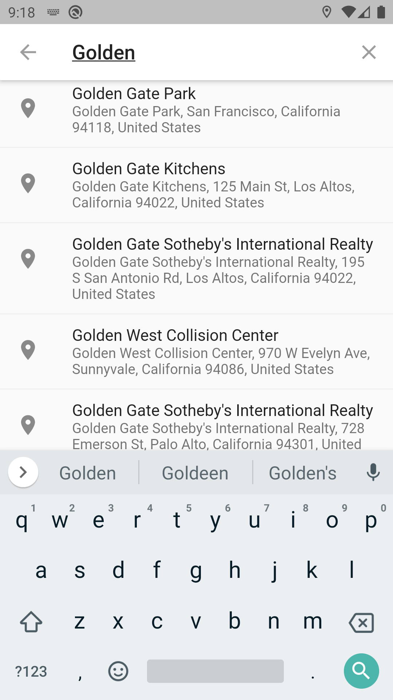

# routes_app

Routes app from Advanced Flutter course

App Features:
* Permision Location permision request
* Location detector
* Integration with Google Maps
* Custom markers design
* Route tracing
* Mapbox routes
* Mapbox geocoding
* Mapbox reverse geocoding
* State management with BLoc

This app consumes Google Maps and Mapbox API, so to test it you need to includes yours.

The app has configured Google Maps to run in android, iOS is not configured.

## Screenshots
### Main screen

### Search sceen
